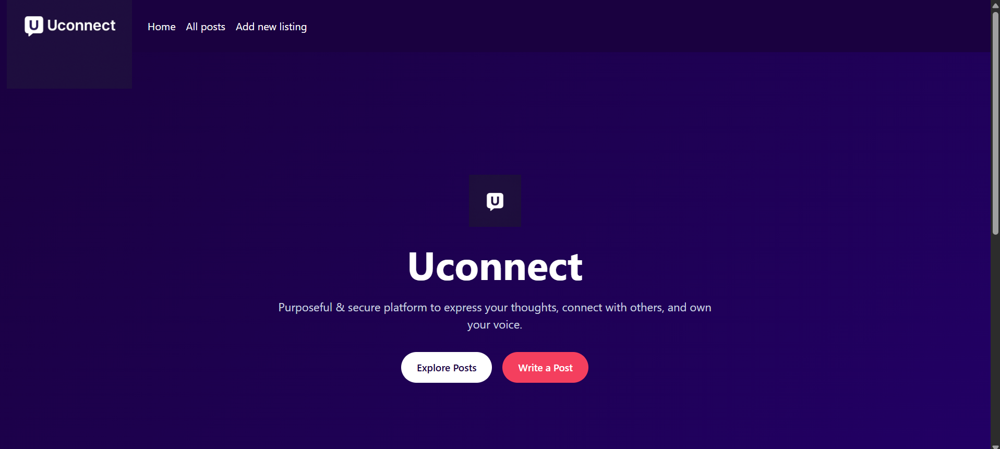
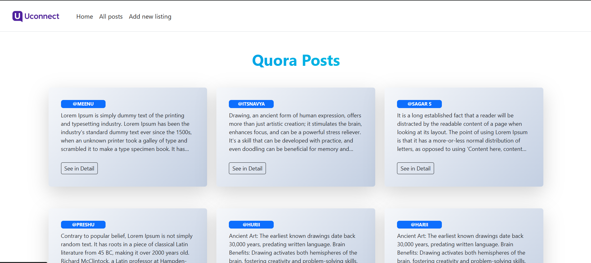
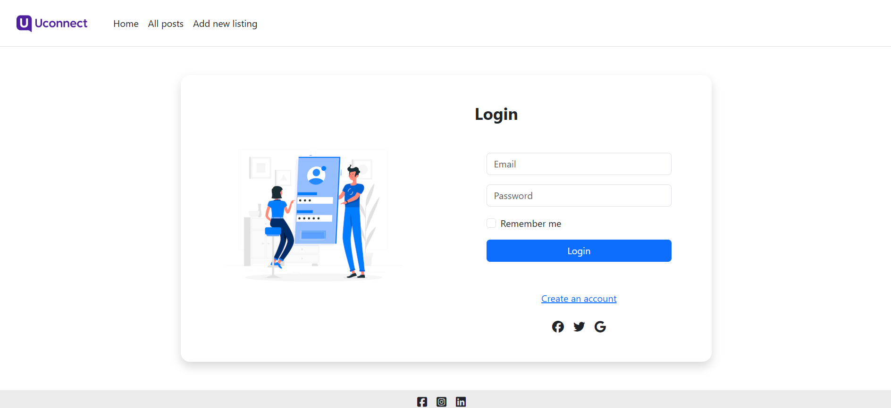
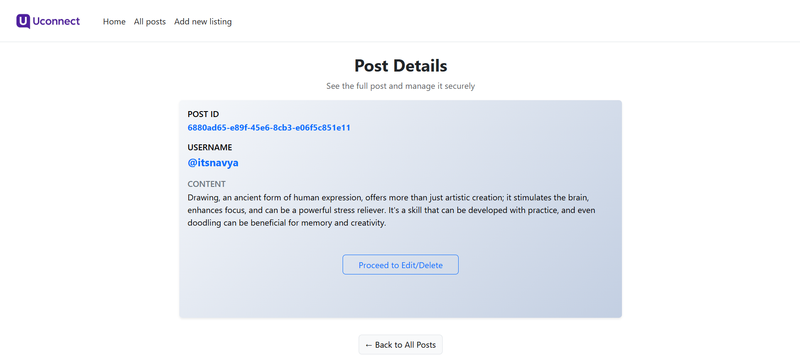

# UCONNECT_PROJECT

_Connect, Create, Empower — Unleash Your Social Potential_


## 🚀 **Built with the tools and technologies:**

 


---

## 📑 Table of Contents

- [Overview](#overview)
- [Getting Started](#getting-started)
  - [Prerequisites](#prerequisites)
  - [Installation](#installation)
  - [Usage](#usage)
- [Features](#features)
- [License](#license)

---

## 📌 Overview

**Uconnect_project** is a full-stack web application tailored for social content platforms. It includes user authentication, session management, and secure CRUD operations for posts using MongoDB and Node.js. 

### Why Uconnect_project?

This project simplifies building social content platforms by integrating:

- 🛡️ **User Authentication**: Secure login, signup, and session management.
- ✍️ **Post Management**: Create, edit, delete posts with user-specific control.
- 🔐 **Access Control**: Password-confirmed edit access for sensitive posts.
- 🧩 **Modular UI Components**: Reusable boilerplate for navbar and footer.
- 🧪 **RESTful API**: Clean server logic and scalable codebase.

---

## 🚀 Getting Started

### ✅ Prerequisites

Ensure you have the following installed:

- Node.js
- npm
- MongoDB (local or Atlas)

### 📥 Installation

1. **Clone the repository:**
   ```bash
   git clone https://github.com/NancyGoyal06/Uconnect_project
   cd Uconnect_project
   ```

2. **Install dependencies:**
   ```bash
   npm install
   ```

3. **Start the server:**
   ```bash
   npm start
   ```

4. **Open your browser and go to:**
   ```
   http://localhost:8080
   ```

### 🔧 Usage

- Create an account (signup).
- Login using email or phone number.
- Add, view, and manage your posts.
- Posts are secured and editable only after password verification.

---
## ⭐ Features

- Secure Signup/Login with Bcrypt
- Session Handling with Express-Session
- User-based Post Ownership
- Password-Protected Edit Access
- RESTful Routes for CRUD
- Bootstrap-based Responsive UI
- Cleanly Structured Views (EJS)

---

## 📄 License

This project is open-source and available under the [MIT License](LICENSE).

---
## Screenshots











## 🤝 Contributing

Feel free to fork this repo and submit a pull request. Contributions are welcome!

